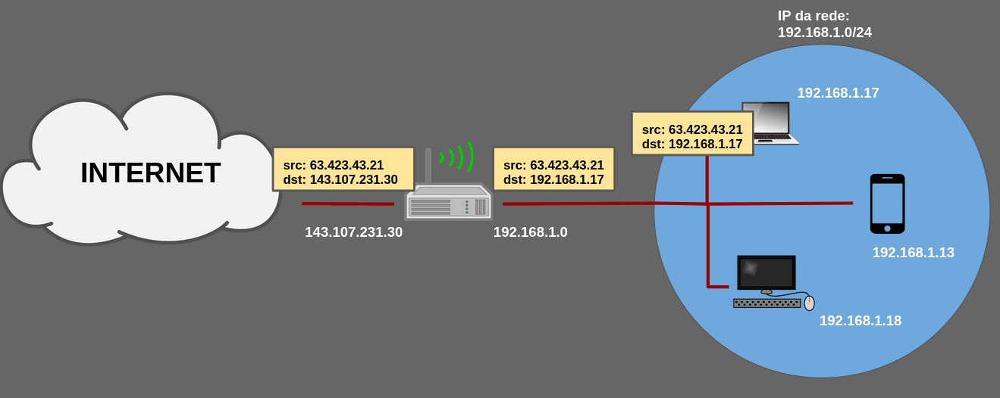

# NAT

Nat não é um apelido para Natália. NAT(Network Address Translation) é o motivo pelo qual podemos ter "apenas" 4.2 bilhões de endereços IPv4, mas o número de dispositivos conectados ser muito maior.
Esta é parte da resposta de "Por que o meu endereço IP é sempre 192.168.X.X na rede da minha casa e da casa de outras pessoas?".

## Estrutura de uma rede com NAT

O tipo mais básico de NAT provavelmente utilizamos todos os dias. Trata-se das redes locais domésticas.
Primeiramente, vale entender que a faixa de endereços 192.168.0.0/24 é reservada justamente para uso em redes locais. Então os servidores [DHCP](dhcp.md) configuram

## Como é feita a tradução de endereços

O gateway que realiza a NAT possui uma tabela interna, que armazena a relação entre saída e os cientes.

## Exemplo de comunicação através de NAT

### Rede hipotética

