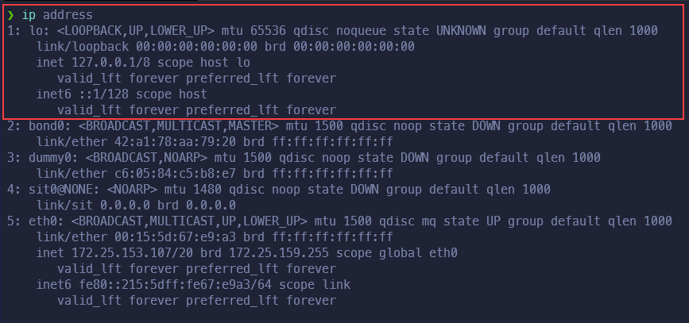

# Camada de Rede

Nessa camada podemos começar a falar de Internet, pois ela é baseada
nas camadas TCP/IP, na verdade, elas são as diretrizes práticas para a
implementação da camada de transporte e de rede respectivamente. A
camada de rede (a teórica do modelo OSI) é responsável por garantir o
envio e roteamento de pacotes entre computadores em redes distintas.
Para realizar esse tarefa, ela implementa os seguintes mecanismos:

-	Endereçamento lógico e hierárquico
-	Roteamento de pacotes
-	Interfaces de rede

## Endereçamento lógico

Endereçamento 'virtual' de cada nó (aparelho, como um computador ou um
celular) na rede. Esse endereçamento não é fixo como o MAC address, que
é intrínseco ao Hardware, mas sim alocado de acordo com algum protocolo
especificado. Adicionalmente pode ser alocado estaticamente (fixo) ou
dinamicamente (um servidor designa os endereços conforme necessário).

Vale salientar também que o endereço dessa camada possui duas partes com
funções diferentes. A primeira parte é a identificação da rede a qual
o nó pertence, dessa forma podemos identificar quais computadores estão
interligados pela mesma rede. A segunda parte é a identificação do
computador propriamente dito. Podemos fazer um paralelo com o cotidiano,
imagine um conjunto de casas em uma rua, elas possuem duas partes no
endereço, o nome da rua (parte de rede) e o número da casa (parte do
*host*).

### IPv4

Concebido em 1983, o IPv4 (Internet Protocol version 4) foi o primeiro
protocolo amplamente adotado para endereçamento lógico. Ele descreve cada
endereço usando 32 bits dividos em 4 seções de 1 byte, ou seja **4 octetos**. 

Dessa forma, permite 2³² = 4.294.967.296 (4 bilhões) endereços únicos, o que
rapidamente se tornou insuficiente para acomodar a grande quantidade de
aparelhos com acesso a internet. 


### IPv6

Criado em 1995, o protocolo IPv6 (Internet Protocol version 6) veio para
expandir a quantidade de endereços cobertos pelo IPv4. Ele descreve os
endereços usando 128 bits ou **8 grupos de 4 digitos hexadecimais**. 

Isso nos dá 2¹²⁸ ou, aproximadamente 3,4 ⋅ 10³⁸ endereços. Comparativamente,
temos 79 milhões de bilhões de trilhões de vezes a quantidade de endereços
possiveis com o IPv4.


Além de expandir imensamente a quantidade de endereços possíveis, o IPv6
possui duas características muito úteis:

-	Retrocompatibilidade com IPv4
	-	**IPv4:** 192.0.2.33
	-	**IPv6:** ::ffff:192.0.2.33  (basta usar o prefixo **::ffff:**)

-	Compressão de endereços por omissão de zeros à esquerda
	-	**IPv6:** 2001:0db8:c9d2:0012:0000:0000:0000:0051
	-	**IPv6 comprimido:** 2001:db8:c9d2:12::51

### Máscaras de rede

As máscaras de rede ou Network masks são, também, uma sequencia formada
por 4 octetos e servem para dividir um IP em duas porções:

-	Rede
-	Host

Para descobrimos a porção da rede a partir de um IP, realiza-se um bitwise
& (AND) entre o IP e a máscara. Vamos exemplificar o procedimento abaixo
usando uma máscara de 24 bits (3 octetos), mas lembre-se que ela pode ter
outros tamanhos a depender da configuração da rede.

```
	11000000 00000000 00000010 00001100   (192.0.2.12)      IP
	11111111 11111111 11111111 00000000 & (255.255.255.0)   Netmask
	-----------------------------------
	11000000 00000000 00000010 00000000   (192.0.2.0)      Endereço do IP
 ``` 

Efetivamente, selecionamos apenas os 3 primeiros octetos para endereçar nossa
rede e separamos o octeto restante para identificar os 256 (ou 2⁸) possíveis
hosts nessa rede. Dessa forma teremos, nessa rede, os hosts:

-	192.0.2.1
-	192.0.2.2
-	192.0.2.3
-	...
-	192.0.2.254

Você deve ter percebido que falamos 256 hosts possíveis, mas somente listamos
254. Isto acontece porque o primeiro endereço é reservado como endereço de
rede (neste caso, 192.0.2.0) e o último, como endereço de _broadcast_ ou
difusão (neste caso, 192.0.2.255).

Porém, como a tradução de uma máscara para sua forma binária não é algo tão
natural, existe uma notação muito mais amigável:

-	192.0.2.12/24
-	2001:db8::/32

Nessa notação, teremos um IP seguido de quantos bits estão reservados para
o endereço de rede (no caso acima 24 bits e 32 bits, respectivamente).

## Roteamento

O roteamento consiste em transportar pacotes de dados entre redes distintas,
tentando ao mesmo tempo descobrir a melhor rota e entregar integralmente os
dados. Para isso, vão ser utilizados endereços que identificam quais nós da
rede receberão a chamada. Cada propagação de pacote, de um roteador para
outro, é chamado de _hop_.

Nesse momento, trabalha-se quase exclusivamente com a parte de rede do
endereço. O roteador é um equipamento especializado para fazer esse
encaminhamento de pacotes e, por isso, deve estar conectado em mais de
uma rede. Quando ele recebe um pacote, verifica qual o endereço de destino
do pacote e procura na sua tabela de roteamento se ele está conectado nessa
rede. Se ele estiver, já pode enviar o pacote para o *host* certo (o
destinatário do pacote). Caso não esteja, ele envia o pacote para alguém
que tenha mais conhecimento, esta pessoa é o chamado **default gateway**.

<!-- Inserir imagem / gif aqui! -->

## Interface de Rede

Geralmente associada à hardware, como à Placa de rede, a interface é
essencial para estabelecer conexões - sem ela isso não é possivel. Cada
interface identifica um aparelho para as tabelas de rota e armazena suas
configurações como o IP. 

Um computador pode ter mais de uma interface, o que possibilita distribuir
o tráfego entre as interfaces ou simplesmente oferecer serviços diferentes.

Um exemplo extremamente importante de interface virtual é a interface
_loopback_ ou _lo_ , que endereça a própria máquina - permitindo a
comunicação entre aplicações ou processos de um computador com outras
aplicações ou processos nesse mesmo computador.

Para vermos quais interfaces estão atualmente presentes, usamos o comando:
				
```
	ip address
```



Assim, conseguimos visualizar que a interface loopback ou _lo_ tem o endereço
_127.0.0.1/8_ para o IPv4 e _::1/128_ para o IPv6.
